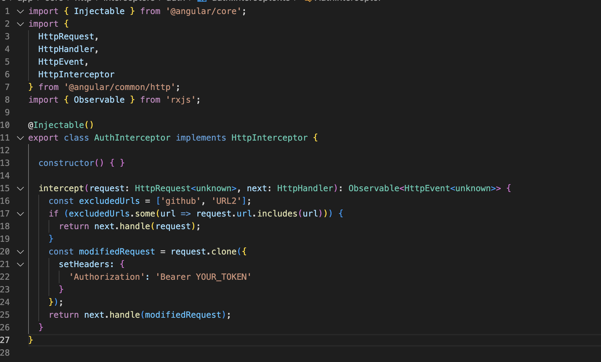
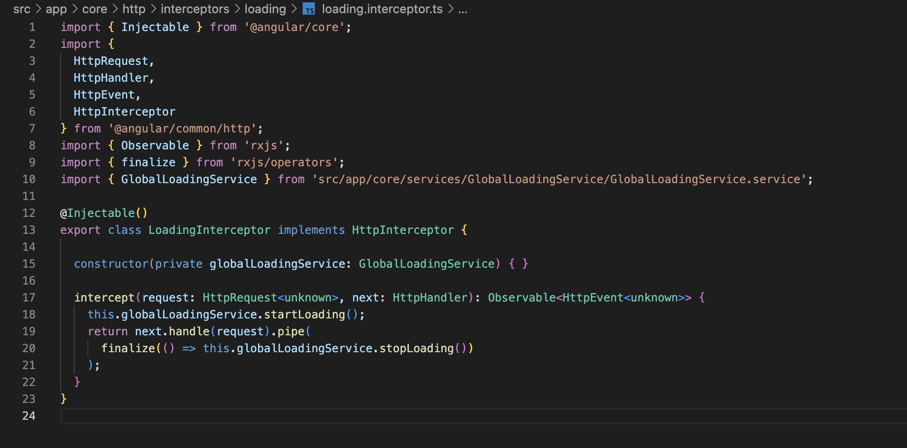
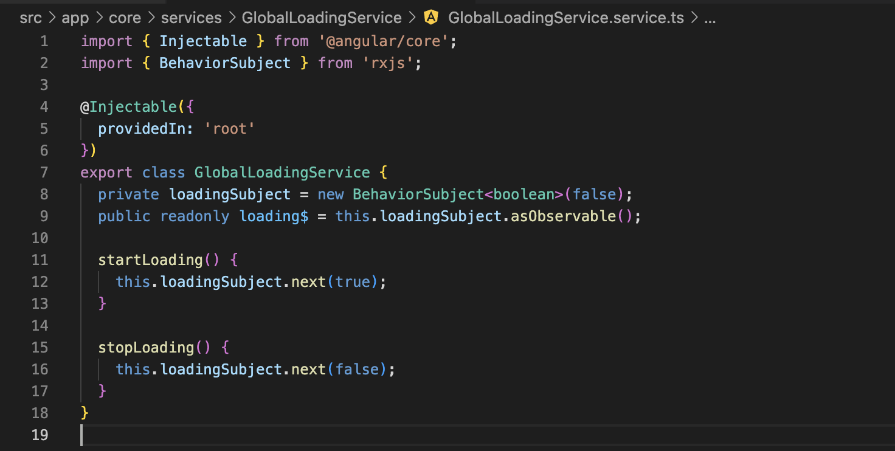

# angular-interceptors

- Welcome to the angular-interceptors project! This document provides instructions on how to set up, run, build, and test the codebase.
- This project was developed to study about angular interceptors and the power of this solution. I developed some important things for any application.

## Table of Contents

- [Important features](#important-features)
  - [AuthInterceptor](#authinterceptor)
  - [LoadingInterceptor](#loadinginterceptor)
  - [GlobalLoadingService](#globalloadingservice)
- [Prerequisites](#prerequisites)
- [Installation](#installation)
- [Usage](#usage)
  - [Running the Application](#running-the-application)
  - [Building the Application](#building-the-application)
  - [Running Tests](#running-tests)

## Important features

- This features are cool and importnat because without this we would need to:
  - Add auth headers for each request in the entire application.
  - Set loading for each request in the entire application.
  - Do this simple logic in the entire application.

### AuthInterceptor

- To set default authorization headers in any request of my application, but I can exclude URLs from this if not necessary.
  

### LoadingInterceptor

- To automatically set the loading as true or false depending of the requests.
  

### GlobalLoadingService

- A store service to manage the state of loading inside the entire application easily.
  

## Prerequisites

Before you begin, make sure you have the following software installed on your machine:

- Node.js (v18.17.1)
- npm (Node Package Manager)
- Angular CLI (v16.2.0)

## Installation

1. Clone this repository to your local machine using the following command:

   ```bash
   git clone <repository-url>
   ```

2. Navigate to the project directory:

cd angular-interceptors

3. Install project dependencies using npm:

```
  nvm i 18.17.1
  nvm use
  npm install
```

## Usage

### Running the Application

To run the application locally, use the following command: `npm start`

This will start the development server and launch the application in your default web browser. The app will automatically reload if you make any changes to the source code.

### Building the Application

To build the application for production, execute the following command: `npm run build`

This will create a production-ready build of the application in the `dist/` directory.

### Running Tests

You can run tests using the following command: `npm test`

- For more advanced configurations, please refer to the official Angular documentation.
